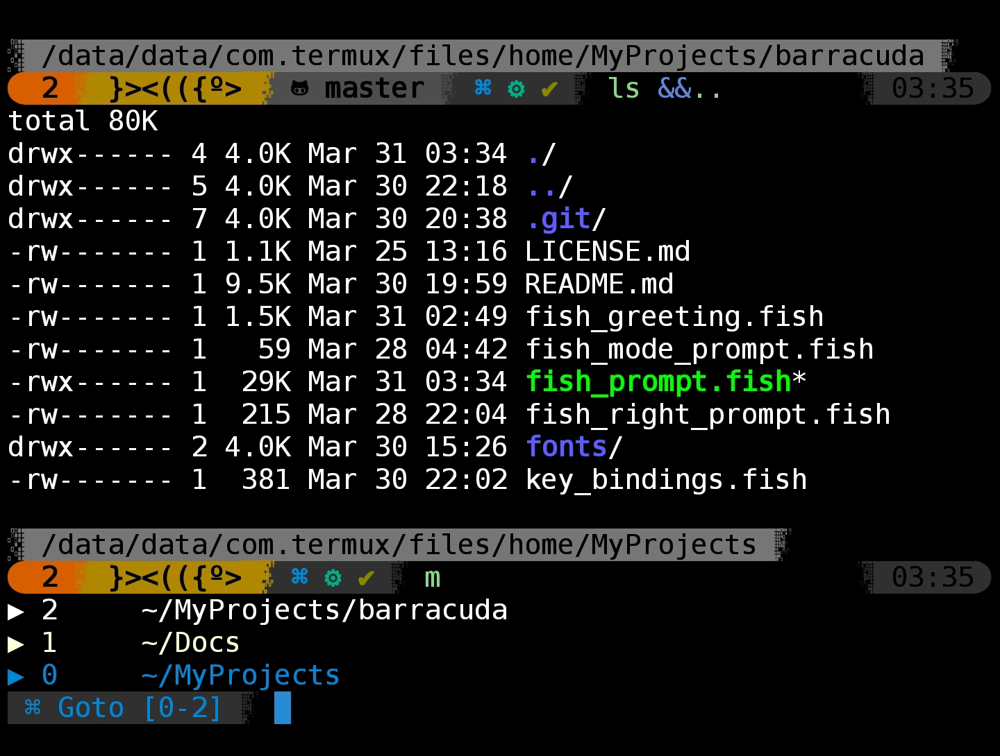

# Barracuda theme (for Termux terminal)

This is basically a fork of [oh-my-fish/theme-budspencer](https://github.com/oh-my-fish/theme-budspencer), which means it keeps all it's awesome features. I just added a few things to adjust it to mobile devices. 

I also made a few visual changes taking advantage of Powerline Symbols.

This is:

> A theme for nerds, makes fish even more powerful. It's equipped with a hell of a
lot of nice functions and key bindings to speed up your workflow.

## Screenshot



## Requirements

* An up-to-date fish shell version from [github][fish-git] or a
[nightly build][fish-nightly].
* Patched Powerline fonts installed. \(See how to install [here](https://github.com/powerline/fonts)

Non standard tools:

* figlet `apt install figlet`
* Termux:API plug-in \(I recommend to download **Termux** and **Termux:API** from [F-Droid](https://f-droid.org) as both apps most have the same PGP signature.\) 
* termux-api `apt install termux-api`
* nodejs `apt install nodejs` (Optional. Only if you want to show node version in left prompt)

## Configuration

### General configuration

The theme behaves similar to vim's airline/powerline plugins. Thus, it needs a
[powerline font][font].
It's also crucial to have vi mode enabled. Thus, execute
```
set -U fish_key_bindings fish_vi_key_bindings
```
before enabling the theme.

### Colors

Redefine `$barracuda_colors` with the `set` command in order to change the
colors of the prompt.

Example:
```
set barracuda_colors 000000 333333 666666 ffffff ffff00 ff6600 ff0000 ff0033 3300ff 0000ff 00ffff
00ff00
```
will result in a prompt like this:
![color replace example][colors]

Two color schemes for bright and dark environments are predefined. You can
enable them with `day` and `night`, respectively.

### Command history
Commands that shouldn't appear in the command history are defined by a universal
list `$barracuda_nocmdhist`. Default:
```
set -U barracuda_nocmdhist c d ll ls m s
```

### Disable/reenable greeting

Disable:
```
set -U barracuda_nogreeting
```

Reenable:
```
set -e barracuda_nogreeting
```

### Show Node version

To show your current node version, do following in your Fish configs

Enable:
```
set -g barracuda_alt_environment "node -v"
```

Disable:
```
set -U barracuda_alt_environment
```

## Outer prompt segments

- Vi mode is indicated by color of outer segments, cursor color also changes
  if terminal supports it:
    * green: NORMAL mode
    * yellow: INSERT mode
    * blue: VISUAL mode

## Left prompt segments

- Prompt line number
- Barracuda ASCII logo
- Git repository information
- Status symbols
    * ✻: keep track of this shell session, can be toggled with `#` to show the number of
       the session within the sessions list
    * ⌘: present working directory is in bookmark list, can be toggled with `#` to
        show the number of the bookmark
    * V: vi is parent process
    * R: [ranger][ranger] is parent process
    * ⚙: there are background jobs, can be toggled with `#` to show the amount of
        background jobs
    * 🔒: no write permissions in present working directory
    * ⚔: there are tasks scheduled for this week, can be toggled with `#` to
        show the amount of weekly tasks
    * ⚑: there are appointments for today, can be toggled with `#` to
        show the amount of appointments
    * ✔: last command succeeded, can be toggled with `#` to show the status value
    * ✘: last command failed, can be toggled with `#` to show the status value
    * ⚡: superuser indicator
- Present working directory
- Active Python [virtual environment](https://virtualenv.pypa.io/en/latest/). Requires [Virtual Fish](https://github.com/adambrenecki/virtualfish/)

## Right prompt segments

- Shows a timestamp 

## Toggle prompt segments

The following shortcuts need vi-mode:
- Style of "present working directory"-segment can be toggled in NORMAL and in
  VISUAL mode with space bar
    * styles implemented:
        - `short` (shows username, short hostname and truncated path; recommended in
          most cases)
        - `long` (shows username, full hostname and full path; useful for copy-paste
          in ssh connections)
        - `none` (shows nothing except small delimiter; useful for small terminals)
        - If prompt is toggled with `#`, the IP address is shown instead of the
          hostname.
    * configurable by universal list `$barracuda_pwdstyle` (if not set, defaults to
      `short long none`); note that changes to `$barracuda_pwdstyle` keep persistant as it's
      a universal variable.

![pwd style][pwdstyle]

- Style of symbols can be toggled in NORMAL and in VISUAL mode with `#`
    * styles implemented:
        - `symbols` (shows status symbols)
        - `numbers` (shows numbers instead of symbols in left prompt as well as amount of changes in
          right git prompt)

Note, the format is _username@hostname:pathname_. Thus, you can cut
the whole string with your mouse and paste it into `ssh` commands.

## Quickly navigate in history of working directories

The function `d` drops down a menu showing the history as enumerated list. Unlike
fish's builtin `dirh`, `d` does not show any duplicates. Enter a number to jump
to a directory within the list.

![dir menu][dirmenu]

The following shortcuts need vi-mode:
- Press `H` in NORMAL mode to change present working directory to previous
  working directory in history.
- Press `L` in NORMAL mode to change present working directory to next working
  directory in history.

## Quickly navigate in command history

The function `c` drops down a menu showing the command history as enumerated list similarly to
the `d` function. Selections are also pasted into the X clipboard. It's possible
to load a command of a former prompt by giving the prompt line number as
argument.

## Bookmarks

A bookmark can be created with `mark`. It can be removed with `unmark`. 

`unmark` can take an argument to remove a specific bookmark in the bookmark list. 
Simply add the number of the bookmark you would like to remove as the argument.

Bookmarks are universal and thus persistant.
A new shell automatically changes working directory on startup to newest bookmark.
`m` is a function that drops down a menu showing the bookmarks as enumerated list
equivalently to `d`.

The following shortcuts need vi mode:
- Create a bookmark for present working directory with `m` in NORMAL mode.
- Remove a bookmark for present working directory with `M` in NORMAL mode.

By default the shell will change to the directory of the latest bookmark on a new session. 
This can be disabled by adding the following line:

```
set -U budspencer_no_cd_bookmark
```

## Edit commandline with your favorite editor

The function `edit-commandline` let you edit the commandline with your editor.
It makes the commandline as powerful as your editor. If `$EDITOR` is not set,
vi is used.

The following shortcut needs vi mode:
- Type `.` in NORMAL mode to edit commandline in editor.

## Sessions

Shell session can be stored with `s <session name>`. If a session with `session
name` already exists, the session with this name will be attached. If a session with
`session name` is already active within another terminal, this terminal will be
focussed.

A list of available sessions can be shown with `s`.

A session can be erased with `s -e <session name>`.

Type `s -d` to detach current session.

## Set window title

Just type `wt <title>`.

## Ring the bell in order to set the urgency hint flag

If you have configured your terminal application to use the visual bell, your
window manager will tell you when a job running in your shell has finished. You
don't need to check manually whether it's done.

If you have still activated the acoustic bell, you probably hate that feature.
Switch it off in that case:
```
set -U barracuda_nobell
```

## TODO

- vi REPLACE mode, as soon as REPLACE mode is implemented within fish

## Feedback

Give me feedback if you ...
* ... have ideas how I could improve budspencer.
* ... have problems with budspencer.
* ... have questions concerning budspencer.

[font]: https://github.com/Lokaltog/powerline-fonts
[ranger]: http://ranger.nongnu.org/
[remind]: http://www.roaringpenguin.com/products/remind
[fish-git]: https://github.com/fish-shell/fish-shell.git
[fish-nightly]: https://github.com/fish-shell/fish-shell/wiki/Nightly-builds
[screenshot]: https://raw.githubusercontent.com/tannhuber/media/master/budspencer.jpg
[colors]: https://raw.githubusercontent.com/tannhuber/media/master/budspencer_replace_colors.jpg
[dirmenu]: https://raw.githubusercontent.com/tannhuber/media/master/budspencer_dir_menu.jpg
[pwdstyle]: https://raw.githubusercontent.com/tannhuber/media/master/budspencer_pwd_style.jpg
